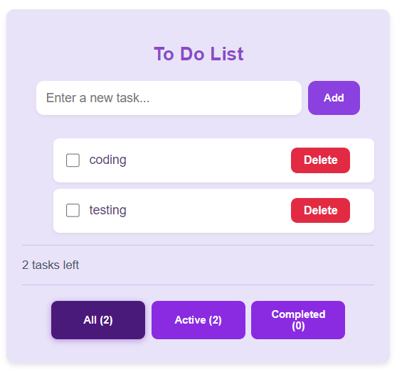
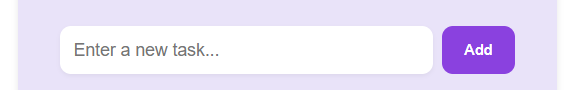
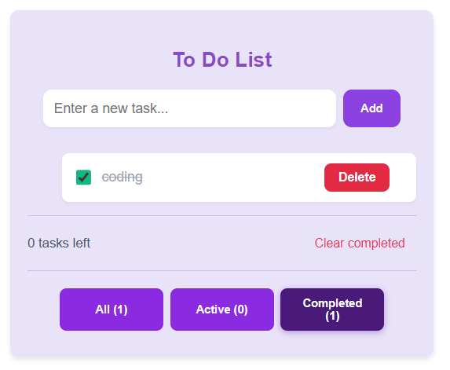
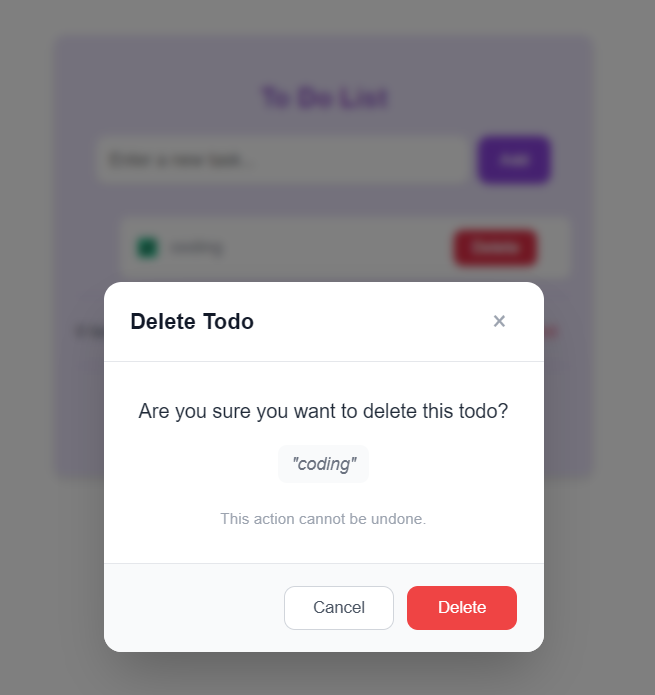
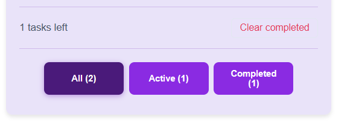
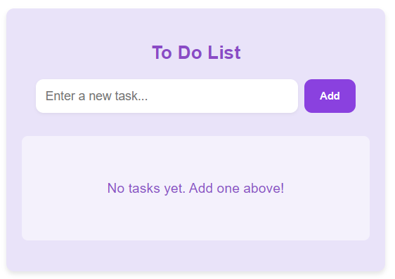

# ✅ Todo List App

A beautiful and functional Todo List application built with React.js. Manage your tasks efficiently with a clean and intuitive interface.

## ✨ Features

- **Create Tasks** - Add new tasks to your todo list
- **Complete Tasks** - Mark tasks as completed with a single click
- **Delete Tasks** - Remove tasks you no longer need (with confirmation modal)
- **Filter Tasks** - View all, active, or completed tasks
- **Task Statistics** - See how many tasks are left to complete
- **Clear Completed** - Remove all completed tasks at once
- **Persistent Storage** - Tasks are saved in your browser's localStorage
- **Responsive Design** - Works perfectly on all devices

## 🖼️ Screenshots

### Main Interface

*The main todo list interface with all features*

### Adding a Task

*Easy task creation with a simple input field*

### Task Completion

*Visual indication of completed tasks*

### Delete Confirmation

*Safe deletion with confirmation modal*

### Filtering Tasks

*Filter tasks by status (All/Active/Completed)*

### Empty State

*Clean empty state when no tasks exist*

## 🚀 Live Demo

Check out the live demo: [Todo App Demo](https://eskandr5.github.io/To-do/)

## 🛠️ Technologies Used

- **React.js** - Frontend library
- **CSS3** - Styling and animations
- **localStorage** - Client-side data persistence
- **React Hooks** (useState, useEffect) - State management

